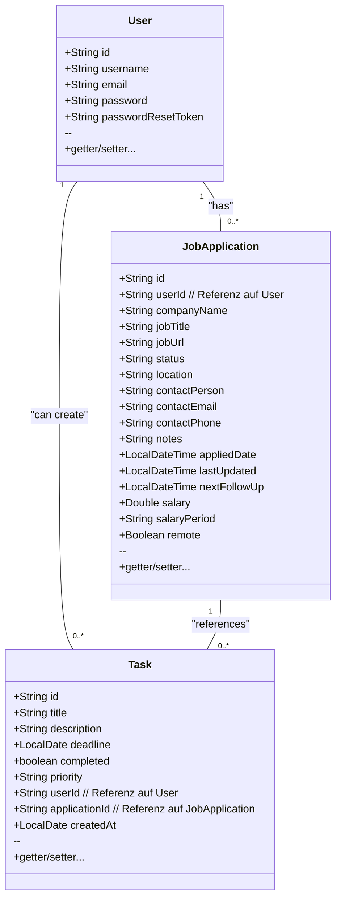

# AppliCare – Dokumentation


---

## 1. Titelblatt

- **Projekt:** AppliCare
- **Module:**
  - M294 (Frontend-Entwicklung mit React)
  - M295 (Backend-Entwicklung mit Spring Boot)
- **Autor:** Yanis Sebastian Zürcher
- **Abgabedatum: 15.01.25**

---

## 2. Inhaltsverzeichnis

1. [Projektidee](#projektidee)
2. [Anforderungskatalog](#anforderungskatalog)
3. [Klassendiagramm](#klassendiagramm)
4. [Storyboard &amp; Screen-Mockups](#storyboard--screen-mockups)
   1. [Storyboard](#storyboard)
   2. [Screen-Mockups](#screen-mockups)
5. [REST-Schnittstellen](#rest-schnittstellen)
   1. [Backend-Endpunkte](#backend-endpunkte)
   2. [Datentypen](#datentypen)
6. [Testplan &amp; Testdurchführung](#testplan--testdurchführung)
   1. [Frontend-Testfälle](#frontend-testfälle)
   2. [Backend-Testfälle](#backend-testfälle)
7. [Installationsanleitung](#installationsanleitung)
   1. [Frontend (M294)](#frontend-m294)
   2. [Backend (M295)](#backend-m295)
8. [Hilfestellungen](#hilfestellungen)

---

## 3. Projektidee

**Elevator Pitch (kurz und prägnant auf max. halbe A4-Seite)**

**AppliCare** ist eine Full-Stack-Anwendung zur Verwaltung von Job-Bewerbungen(Applications). Users können Bewerbungen (Job Applications) anlegen und deren Status im Bewerbungsprozess (z.B. APPLIED, SCREENING, INTERVIEWING, OFFER, ACCEPTED, REJECTED) verfolgen. Zusätzlich lassen sich *Tasks* (Aufgaben/Todos) erfassen, die entweder allgemein sind oder einer bestimmten Bewerbung zugeordnet werden können.

**Zentrale Nutzenargumentation**:

- **Alle Bewerbungen und zugehörige Aufgaben an einem Ort**
- **Einfache Statusübersicht** (werde ich gerade interviewt, habe ich ein Angebot, bin ich abgelehnt worden usw. (selbst updatebar))
- **Erinnerungsfunktion** via Tasks (z.B. „Lebenslauf aktualisieren“, „Follow-up E-Mail schreiben“)
- **Zwei-Komponenten-System**:
  - **Frontend** (React-Client) für einfache Handhabung im Browser
  - **Backend** (Spring Boot, MongoDB) für sichere Datenhaltung

---

## 4. Anforderungskatalog

Nachfolgend die Kernaufgaben und Anforderungen (funktional):

1. **Benutzerverwaltung**

   - Registrieren mit Username + E-Mail + Passwort
   - Login mit Username *oder* E-Mail + Passwort
   - „Passwort vergessen“ -> Reset E-Mail mit Token
   - Profilpflege (E-Mail, Username ändern)
   - Passwort ändern
   - Account löschen (alle zugehörigen Daten entfernen)
   - Theme ändern (Light, Dark, System)
   - Logout
2. **Bewerbungsverwaltung (Job Applications)**

   - CRUD (Erstellen, Lesen, Bearbeiten, Löschen)
   - Status ändern (APPLIED, SCREENING, INTERVIEWING, OFFER, ACCEPTED, REJECTED)
   - Felder wie Firmenname, Jobtitel, Kontaktperson, Notizen, Remote toggle usw.
   - Sortierung, Filterung (z.B. nach Status, Datum)
3. **Aufgabenverwaltung (Tasks)**

   - CRUD für Aufgaben (Titel, Beschreibung, Deadline, priority (HIGH, MEDIUM, LOW))
   - Zuordnung zu einer bestimmten Bewerbung (optional)
   - Anzeige aller eigenen Tasks in einer Liste (Dashboard)
   - Umschalten des Status (wenn completed, dann durchgestrichen) `completed`
4. **Sicherheit & Validierung**

   - JWT-Authentifizierung
   - Hashing (BCrypt) der Passwörter
   - serverseitige Validierung (Spring Validation) die aufs frontend gepasst wird & react frontend Validierung (zb. Pflichtfelder)
   - Fehlerbehandlung: 400er bei Invalid Data, 401/403 bei fehlender Authentifizierung
5. **Frontend-spezifische Anforderungen (M294)**

   - **React-Routing**: Landing (/), Login (/login), Register (/register), Dashboard (/dashboard), Manage (/manage), Settings (/settings)
   - **React-Komponenten**: sinnvolle Aufteilung in Komponenten
   - **Clientseitige Validierung** (Pflichtfelder, Formatprüfungen)
   - **Fehlerhandling** (z.B. Warnungen bei leeren Pflichtfeldern)
   - **Unit-Tests** (mind. 5 Tests)
6. **Backend-spezifische Anforderungen (M295)**

   - **Spring Boot mit Maven**
   - **Validierung** (Annotationen @NotNull, @Pattern etc.)
   - **REST-API** mit CRUD-Endpunkten
   - **Einbindung einer Datenbank** (MongoDB)
   - **Saubere Exceptions** & sinnvolle HTTP-Statuscodes
   - **Unit-Tests** (mind. 5 Tests)

---

## 5. Klassendiagramm



**Erläuterungen**:

- **User**: Enthält login-bezogene Attribute (username, email, password) sowie ein optionales passwordResetToken.
- **JobApplication**: Beschreibt eine Bewerbung (Firma, Position, Status usw.). Das Attribut userId speichert die ID eines Users und stellt damit eine logische Referenz zur User-Collection her.
- **Task**: Zusätzliches To-Do-Item. Kann durch das Feld applicationId an eine spezifische Bewerbung (JobApplication) geknüpft werden. userId stellt eine weitere logische Referenz zur User-Collection dar.

---

## 6. Storyboard & Screen-Mockups

### 6.1 Storyboard

1. **Landing Page**

   - Logo, Kurzbeschreibung
   - Links: „Sign In“ (=> Login Page), „Get Started“ (=> Register Page)
2. **Auth-Pages**

   - **Login**: Eingabe `(usernameOrEmail, password)`, Button „Login“, Link „Forgot Password“
   - **Register**: Eingabe `(username, email, password)`
   - **Forgot Password**: E-Mail eingeben => Token wird per Mail versendet
   - **Reset Password**: Neues Passwort + Bestätigung => Absenden
3. **Main Layout (protected)**

   - **Navigation** (Header)
     - Dashboard (Übersicht)
     - Manage (Bewerbungen)
     - Settings (Profil, Sicherheit)
     - Logout
   - **Footer**: Infos zu Version, ggf. Social Links
4. **Dashboard**

   - Statistiken (Anzahl Bewerbungen pro Status)
   - Liste offener Tasks
   - ggf. Charts / Diagramme
5. **Manage** (Bewerbungen)

   - Tabelle aller Bewerbungen
   - Buttons: *New Application*, *Edit*, *Delete*
   - Status per Dropdown änderbar
6. **Settings**

   - Profile: Username/Email updaten
   - Preferences: Theme umstellen (Light/Dark/System)
   - Security: Passwort ändern, Account löschen

### 6.2 Screen-Mockups

**Auth Screens**
bild

**Dashboard**
bilder

**Manage**
bild

**Settings**
bilder*

---

## 7. REST-Schnittstellen

### 7.1 Backend-Endpunkte

#### Auth-Endpoints

| **Methode** | **Pfad**                | **Beschreibung**                    |
| ----------------- | ----------------------------- | ----------------------------------------- |
| POST              | `/api/auth/register`        | Registrierung (username, email, password) |
| POST              | `/api/auth/login`           | Login => gibt JWT zurück                 |
| POST              | `/api/auth/forgot-password` | Sendet Reset-Token an Mail                |
| POST              | `/api/auth/reset-password`  | Password-Reset mit gültigem Token        |

#### User-Endpoints

| **Methode** | **Pfad**         | **Beschreibung**                         |
| ----------------- | ---------------------- | ---------------------------------------------- |
| PUT               | `/api/user/profile`  | Username/Email ändern (Form- oder JSON-Daten) |
| PUT               | `/api/user/password` | Passwort ändern (altes + neues)               |
| DELETE            | `/api/user/account`  | User + alle Daten löschen                     |

#### Applications-Endpoints

| **Methode** | **Pfad**                               | **Beschreibung**                        |
| ----------------- | -------------------------------------------- | --------------------------------------------- |
| GET               | `/api/applications`                        | Liste aller Bewerbungen (nur user-spezifisch) |
| POST              | `/api/applications`                        | Neue Bewerbung anlegen                        |
| GET               | `/api/applications/{id}`                   | Einzelne Bewerbung abfragen                   |
| PUT               | `/api/applications/{id}`                   | Bestehende Bewerbung aktualisieren            |
| DELETE            | `/api/applications/{id}`                   | Bewerbung löschen                            |
| PATCH             | `/api/applications/{id}/status?status=XYZ` | Nur den Status updaten                        |

#### Tasks-Endpoints

| **Methode** | **Pfad**             | **Beschreibung**     |
| ----------------- | -------------------------- | -------------------------- |
| GET               | `/api/tasks`             | Alle Tasks des Users laden |
| POST              | `/api/tasks`             | Neue Task anlegen          |
| PUT               | `/api/tasks/{id}`        | Task editieren             |
| PATCH             | `/api/tasks/{id}/toggle` | Task „completed“ toggeln |
| DELETE            | `/api/tasks/{id}`        | Task löschen              |

### 7.2 Datentypen (JSON-Format)

- **JobApplication** (Beispiel POST/PUT):
  ```json
  {
    "companyName": "Google",
    "jobTitle": "Software Engineer",
    "jobUrl": "https://careers.google.com/jobs/...",
    "status": "APPLIED",
    "location": "Zürich",
    "contactPerson": "Hans Muster",
    "contactEmail": "hans.muster@google.com",
    "contactPhone": "+41 12 123 12 12",
    "notes": "Remote möglich?",
    "salary": 120000,
    "salaryPeriod": "YEARLY",
    "remote": true
  }
  ```
- **Task** (Beispiel POST/PUT):
  ```json
  {
    "title": "CV updaten",
    "description": "Neue Projekte einfügen",
    "deadline": "2025-01-30",
    "priority": "HIGH",
    "applicationId": "<die Application-ID>",
    "completed": false
  }
  ```

---

## 8. Testplan & Testdurchführung

### 8.1 Frontend-Testfälle

Mindestens 5 **sinnvolle** Testfälle:

| **Testfall**                     | **Vorgehen**                                                                                     | **Erwartetes Ergebnis**                                                                                |
| -------------------------------------- | ------------------------------------------------------------------------------------------------------ | ------------------------------------------------------------------------------------------------------------ |
| 1.**Registrierung**              | - Auf „Register“ klicken `<br>`- Felder `(Username, Email, Passwort)` befüllen `<br>`- Submit | - Bei korrekten und nicht vorhandenen Daten: Account wird angelegt, Meldung „User registered successfully“ |
| 2.**Login**                      | - Login-Seite aufrufen `<br>`- Gültige `usernameOrEmail` + Passwort eingeben `<br>`- Absenden   | - Token wird im LocalStorage gespeichert `<br>`- Weiterleitung zum Dashboard                               |
| 3.**Neue Bewerbung**             | - Seite „Manage“ -> Button „New Application“`<br>`- Formular ausfüllen -> Submit                | - Bewerbung erscheint in der Tabelle `<br>`- Meldung „Application created successfully“                  |
| 4.**Bewerbung löschen**         | - In der Tabelle bei einer Bewerbung: Klick auf Delete-Button `<br>`- Bestätigen                    | - Die Bewerbung verschwindet aus der Liste `<br>`- Meldung „Application deleted successfully“            |
| 5.**Password Update (Settings)** | - Auf „Settings“ -> „Security“`<br>`- altes Passwort & neues Passwort eingeben `<br>`- Submit  | - Meldung „Password updated successfully“`<br>`- Anschließend Login nur noch mit neuem Passwort         |

### 8.2 Backend-Testfälle

Ebenfalls 5 Beispiele:

| **Testfall**                     | **Methode/Endpoint**            | **Erwartetes Ergebnis**                                                                       |
| -------------------------------------- | ------------------------------------- | --------------------------------------------------------------------------------------------------- |
| 1.**POST /auth/register**        | Duplicate E-Mail angeben              | 400 (Bad Request) + Fehlertext „Email already in use“                                             |
| 2.**POST /auth/login**           | Korrekte Daten => OK / Falsche => 400 | Bei korrekten Daten -> 200 + JSON `{token, username, ...}`, sonst 400 mit passender Fehlermeldung |
| 3.**GET /api/applications**      | Mit gültigem JWT-Header, ohne Body   | 200 + Array mit Bewerbungen des Users `<br>`Ohne oder ungültigem JWT => 403 oder 401             |
| 4.**PUT /api/applications/{id}** | Felder anpassen                       | 200 + aktualisiertes Objekt, bei Not Found => 404, bei Fremd-User => 403                            |
| 5.**DELETE /api/user/account**   | Mit JWT => Account löschen           | 200 + „Account deleted successfully“; alle Tasks + Applications auch weg. Ohne JWT => 403         |

*(Weitere Tests z.B. für Tasks, Filter etc. sind ebenfalls durchzuführen, hier jedoch nur beispielhaft.)*

---

## 9. Installationsanleitung

### 9.1 Frontend (M294)

1. **Voraussetzungen**:

   - Node.js
   - npm oder yarn
2. **Schritte**:

   - **Repository/Zip entpacken**
   - In das Verzeichnis `applicare_frontend/` wechseln
   - `npm install` & `npm insall axios`
   - Starten im Entwicklungsmodus mit `npm run dev`
   - Standardport: [http://localhost:5173](http://localhost:5173)
3. **Konfiguration**:

   - Im `vite.config.js` ist ein Proxy definiert: `'/api' -> 'http://localhost:8080'`.
   - Falls nötig, anpassen falls das Backend auf anderem Port/Server läuft.

### 9.2 Backend (M295)

1. **Voraussetzungen**:

   - Java (OpenJDK 21)
   - Maven
   - MongoDB Atlas
2. **Schritte**:

   - In `applicare_backend/` wechseln
   - **.env** Datei erstellen, ich werde Ihnen die Werte privat oder schon im zip geben geben.
     ```bash
        MONGODB_URI=
        MONGODB_DATABASE=
        MAIL_HOST=
        MAIL_PORT=
        MAIL_USERNAME=  
        MAIL_PASSWORD=
        JWT_SECRET=
     ```
   - `mvn clean install`
   - `mvn spring-boot:run`
   - Backend-Port: [http://localhost:8080](http://localhost:8080)
3. **Datenbank**:

   - MongoDB muss laufen.
   - falls sie in der wiss sind müssen sie hotspot benutzen da die wiss mongodb atlas blockiert.

---

## 10. Hilfestellungen

1. **Internetquellen**
   - [Offizielle Spring Boot Docs](https://docs.spring.io/spring-boot/docs/current/reference/html/)
   - [React + Vite Dokumentation](https://vitejs.dev/)
   - [MongoDB Dokumentation](https://www.mongodb.com/docs/)
   - [Ant Design](https://ant.design/)
   - [ChatGPT](https://chatgpt.com/)

---

**Ende der Dokumentation**
